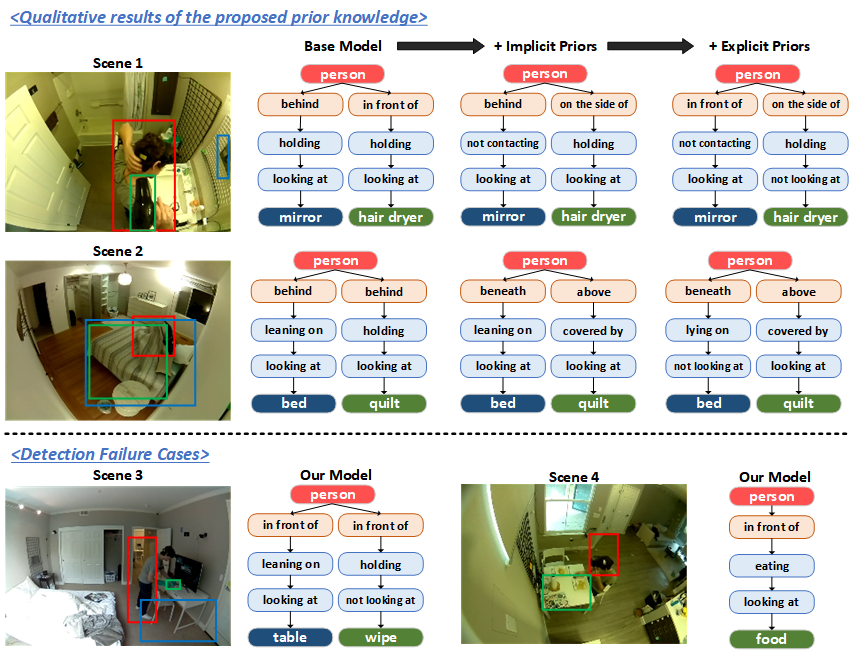

# HIERARCHICAL HOME ACTION UNDERSTANDING WITH IMPLICIT AND EXPLICIT PRIOR KNOWLEDGE

The code will be made public available upon the acceptance.

## Abstract
Existing investigations on action understanding have made noteworthy advancements by treating activities as holistic events occurring in videos. However, these investigations have limited ability to comprehensively extract and represent human experiential knowledge, which hampers various practical applications, such as robotics and human-computer interaction. We argue that human actions can be better understood as hierarchical compositions of multiple interactive objects and atomic actions with spatio-temporal relations. To this end, we propose a hierarchical understanding framework for home actions, which decomposes a single holistic action into multiple quintuples of <subject, spatial relation, operation, gaze, interactive object>. Within this framework, we introduce a two-stage network architecture that leverages multiple prior knowledge in both implicit and explicit ways to facilitate mutual learning within quintuples. In particular, we fully exploit statistical knowledge to enhance the inference of data-driven visual model. Experiments validate the effectiveness of our proposed method. This is also the winning solution for HOMAGE Competition @ ActivityNet Challenge in CVPR 2022 and our brief oral representation is available at https://youtu.be/KK3SPK6iueE?si=hrFZzSABNyrrL6jF&t=1727.
